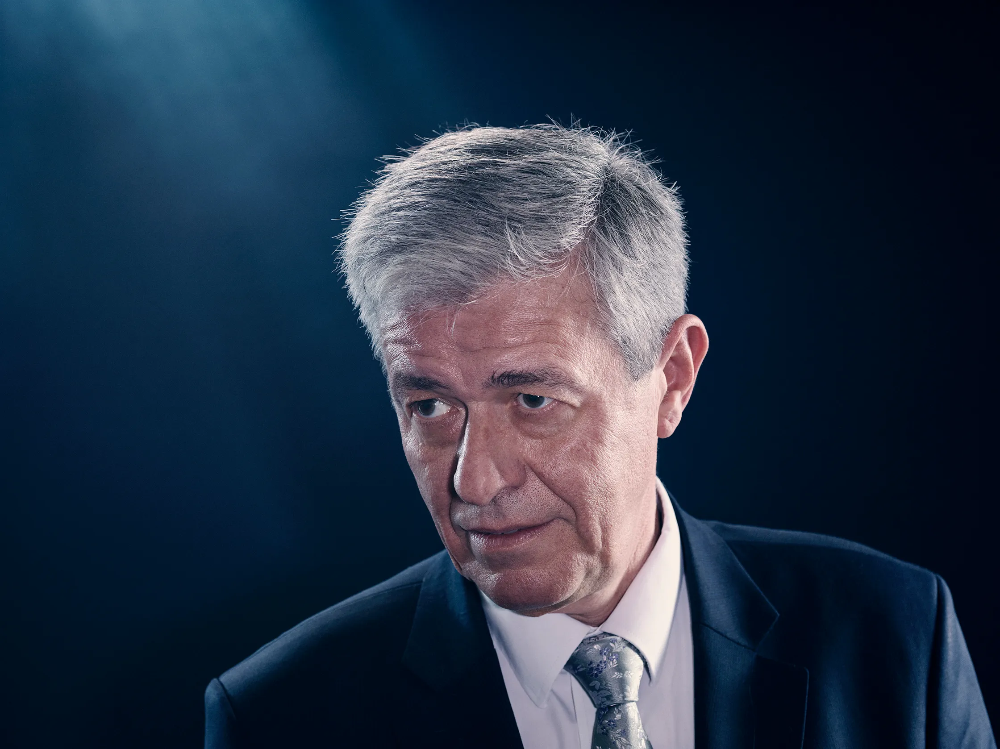
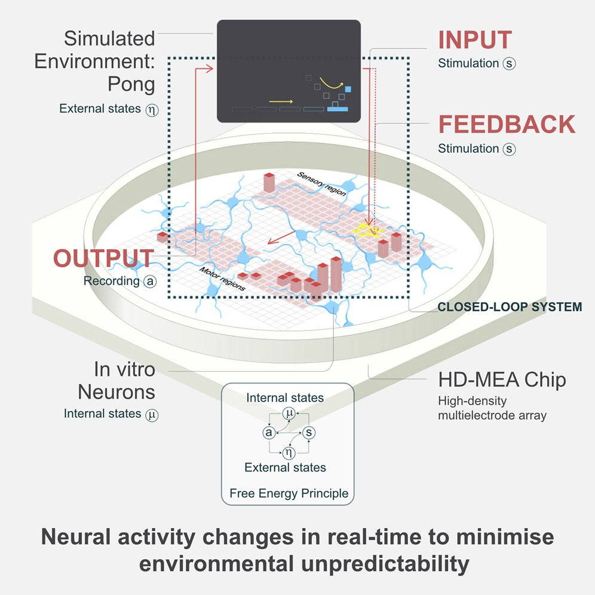
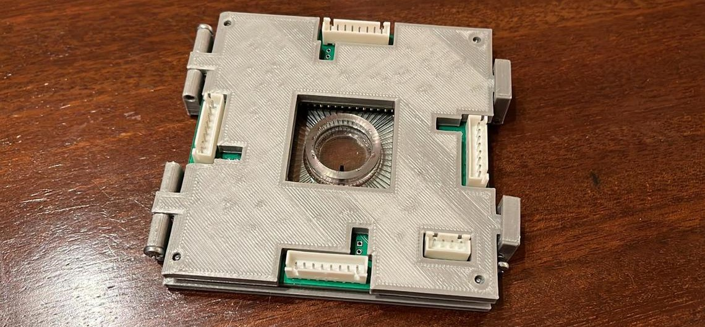

# Intelligent Brain Organoid

Developing Functional Neural Networks in Brain Organoids with FEP

---

# Catalog

1. ### Introduction
1. ### Background
1. ### Proposed Methodology
1. ### One Specific Design

---

# Introduction

## Understanding Brain Organoids

An **artificially grown**, **in vitro**, tissue resembling parts of the human brain.

---

# Introduction

## Understanding Brain Organoids

The purpose: *to study related diseases in a more defined setting*.

---

# Introduction

## What's the Barriers?

- Physically hard to reconstruct.

- Functionally hard to develop.

---

# Introduction

## Possible Solution

- Physically: Focusing on reconstructing a **specific brain region**.

---

# Introduction

## Possible Solution

- Functionally: Actively **"train"** the organoid, giving brain organoids complete stimuli like a real brain will receive.

---

# Background
## Reconstruct Specific Region

Lot's of previous work could be referred directly.

---

# Background
## Free Energy Principle

- Author: Karl Friston (2010)
- A normative theory on **living organism's** intelligence
- Derived from a specific form of **variational bayesian inference**.

---

# Background
## Free Energy Principle
  - Bayesian Brain Hypothesis.
  - Self-Organized System **minimize** it's **free energy (surprise)**.

  

  

  $$
  \begin{align*}
  \underbrace{F(\mu, a; s)}_{\text{free-energy}} &= \underbrace{\mathbb{E}_{q(\psi)} \left[ -\log p(\psi, s, a, \mu \mid \psi) \right]}_{\text{expected energy}} - \underbrace{\mathcal{H}[q(\psi \mid s, a, \mu, \psi)]}_{\text{entropy}} \\
  &= \underbrace{-\log p(s)}_{\text{surprise}} + \underbrace{\text{KL}[q(\psi \mid s, a, \mu, \psi) \parallel p_{\text{Bayes}}(\psi \mid s, a, \mu, \psi)]}_{\text{divergence}} \\
  &\geq \underbrace{-\log p(s)}_{\text{surprise}}
  \end{align*}
  $$

  

---

# Background
## Free Energy Principle

- Internal and external state are separated by **markov blanket**.

- Brain makes **variational bayesian inference**. 

- Brain fitting the world **as precise as possible**.

---

# Background
## Dish Brain

Training a BNN playing video game **based on FEP theory**.

---

# Proposed Methodology

- ### Reconstruct in **Marco** Morphology
  - Reconstruct organoid of a specific brain region with emergence of the markers.

- ### Reconstruct in **Micro** Connectivity
  - Using external stimuli to help (train) the in virto organoid form the **micro** morphology (connections between neurons).

---

# One Specific Design

### A more effective depression model

---

# One Specific Design
## Why Depression Modeling?

- Depression involves complex neural and biochemical disruptions.

- There is still controversy surrounding animal models of depression.

---

# One Specific Design
## Goal

1. Combine electrical and chemical stimuli to train a functional healthy hippocampal region in a brain organoid.

1. Introduce common depression-inducing mechanisms, such as toxic compounds and electrical stimulation, to induce a disease-like state in the hippocampal region.

---

# One Specific Design
## Experimental Design

- Macro Culture

  - Culture hiPSC-derived neurons into hippocampal region directly on MEA Chips.

---

# One Specific Design
## Experimental Design

- Micro Culture

  - Use external stimuli as reward or penalty to train the network.

---

# One Specific Design
## Experimental Design

- Making it Depressed

  - Chemicals: Corticosterone, IL-6, TNF-α.

  - Training with pathogenic stimuli including **electical** and **chemical**.

---

# One Specific Design
## Application

- Innovative approach to model depression mechanisms.

- Drug screening.

- Understanding network-level changes in mental health disorders.

---

# References
- Friston, K. The free-energy principle: a unified brain theory?. Nat Rev Neurosci 11, 127–138 (2010). https://doi.org/10.1038/nrn2787

- In vitro neurons learn and exhibit sentience when embodied in a simulated game-world; Kagan, Brett J. et al.; Neuron, Volume 110, Issue 23, 3952 - 3969.e8

- Kim SH, Chang MY. Application of Human Brain Organoids-Opportunities and Challenges in Modeling Human Brain Development and Neurodevelopmental Diseases. Int J Mol Sci. 2023 Aug 7;24(15):12528. doi: 10.3390/ijms241512528. PMID: 37569905; PMCID: PMC10420018.

---

# Contribution

- 刘思昀: 
  - **Works**: Slides, Seminar
  - **Contents**: Background, Proposed Methodology, Specific Design
- 虞果：
  - **Works**: Seminar
  - **Contents**: Background, Proposed Methodology
- 唐林峥: 
  - **Works**: Presentation, Slides, Seminar
  - **Contents**: Introduction, Background, Proposed Methodology, Specific Design
